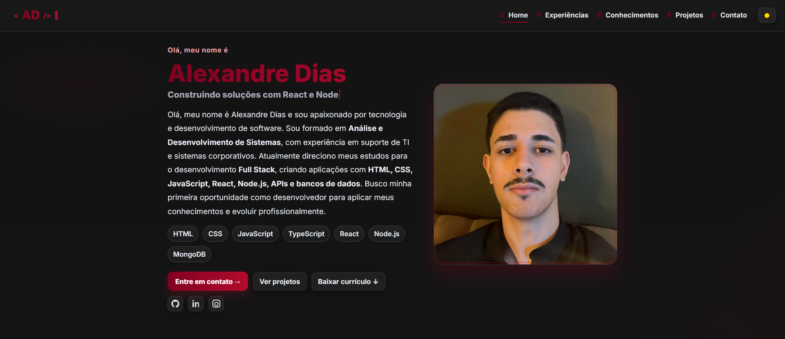
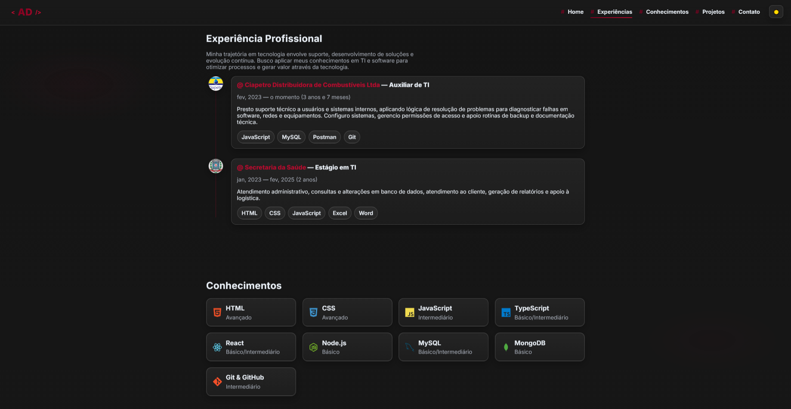
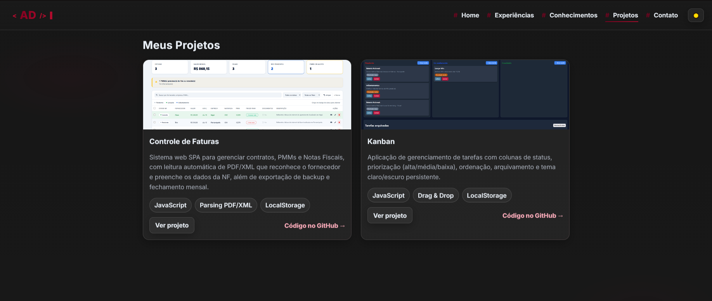

# 💼 Portfólio Alexandre Henrique Dias

### Desenvolvedor Full Stack

---

## 📖 Sobre

Este é o meu portfólio pessoal, desenvolvido para apresentar minha trajetória, experiências, conhecimentos técnicos e projetos como Desenvolvedor Full Stack.

O projeto foi construído do zero utilizando HTML5, CSS3 e JavaScript (ES6+), com foco em performance, acessibilidade, responsividade e boas práticas de SEO. O objetivo é oferecer uma navegação rápida, moderna e destacar meus principais projetos e habilidades de forma clara e organizada.

---

## 🛠️ Tecnologias

| Front-end | Ferramentas |
|------------|-------------|
| HTML5 | Git & GitHub |
| CSS3 (variáveis, grid, flexbox) | GitHub Pages |
| JavaScript (ES6+) | Devicons |

---

## 📸 Screenshots

### Início

### Experiências e Conhecimentos

### Projetos

---

## 🌟 Projetos em destaque

- 📄 **[Controle de Faturas](https://controle-faturas-five.vercel.app/)** — Sistema web para gerenciar contratos, PMMs e notas fiscais, com leitura automática de PDF/XML.
- 📋 **[Kanban](https://kanban-sand-iota.vercel.app/)** — Aplicação de gerenciamento de tarefas com priorização, ordenação e tema persistente.

---

## 📬 Contato

- 📧 E-mail: alexdias0831@gmail.com
- 💼 LinkedIn: [linkedin.com/in/alexandredias0831](https://www.linkedin.com/in/alexandredias0831/)
- 🐙 GitHub: [github.com/AlexandreDias31](https://github.com/AlexandreDias31)

---

Feito com 💻, ☕ e ❤️ por **Alexandre Henrique Dias**

